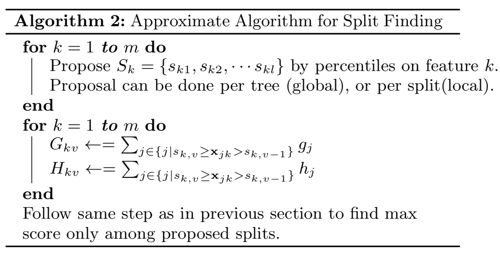

xgboost是一种tree boosting算法，可以看作在GBDT的基础上改进了目标函数、切分点查找、缺失值处理、并行化等方面。

### 原理
首先，xgboost本质上是一个加法模型，通过Gradient Boosting每一步贪心地计算出一个模型（最小化目标函数），最后加在一起得到最终模型。

$\hat{y}_i^{(t)}$是第t步的预测值，从上式可以看到，是由第t步的模型预测值，加上之前所有模型预测值之和。

要确定第t步的模型，通过最小化目标函数得到。定义目标函数为：

l是损失函数，常用的是均方误差，也可以是任意二次可微的函数。与GBDT的目标函数相比，xgboost多了正则化项，T为模型的叶子数，w为每个叶子节点的权重。
$$\Omega(f) = \gamma T + \frac{1}{2}\lambda \sum_{j=1}^T w_j^2$$

对目标函数做二阶泰勒展开，得到：
$$\text{obj}^{(t)} = \sum_{i=1}^n [l(y_i, \hat{y}_i^{(t-1)}) + g_i f_t(x_i) + \frac{1}{2} h_i f_t^2(x_i)] + \Omega(f_t) + constant$$
其中

去除常数项后，得到表达式：

这里$I_j$表示被分到第j个叶子节点的样本集合。进一步令$G_j = \sum_{i\in I_j} g_i$，$H_j = \sum_{i\in I_j} h_i$，代入上式，最终表达式为$$\text{obj}^{(t)} = \sum^T_{j=1} [G_jw_j + \frac{1}{2} (H_j+\lambda) w_j^2] +\gamma T$$
每个叶子节点是独立的，因此根据二次函数极点的知识，可以确定使目标函数最小的每个w的值和目标函数的最小值为：$$\begin{split}w_j^\ast = -\frac{G_j}{H_j+\lambda}\\
\text{obj}^\ast = -\frac{1}{2} \sum_{j=1}^T \frac{G_j^2}{H_j+\lambda} + \gamma T
\end{split}$$
此时，目标函数最小值只跟损失函数的一阶、二阶导数和叶子数有关。推导到这里，如果给定树的结构，那就可以用目标函数来衡量这个树的好坏。现在就需要用这个目标函数来确定树的结构（如何分裂）。

### 切分算法
目的是要找到一个切分点，将样本分为左右两部分（L和R）。类似CART决策树的基尼指数，xgboost根据上文推导的目标函数，定义切分的增益:
$$Gain = \frac{1}{2} \left[\frac{G_L^2}{H_L+\lambda}+\frac{G_R^2}{H_R+\lambda}-\frac{(G_L+G_R)^2}{H_L+H_R+\lambda}\right] - \gamma$$
$\gamma$是常数项，如果Gain小于某个常数，就不分裂，相当于决策树中的剪枝。因此xgboost不需要再进行剪枝来正则化。

一般情况下，与GBDT类似，遍历所有特征和所有可能的切分点（如果是连续特征，排序后取两个相邻值的中点）。这种遍历的算法只支持单个机器，不支持分布式。

如果可能的切分点太多，无法遍历的情况下，xgboost提出了一种近似算法，根据特征数值分布的比例，将样本分为不同的bucket（通常分成32-100份），每个bucket之间作为可能的切分点。按比例划分方法：按照特征值排序后，以二阶导数累加比例划分

实际应用中，数据往往有缺失值，或是数据是稀疏的，针对这个情况，xgboost提出了sparsity-aware的切分点寻找算法。对于每个特征，根据分布找到可能的切分点后，分别计算把缺失值样本放到左子节点和右子节点，学习到最优的切分点和缺失值的分类方向。

#### 权重缩减和列抽样
xgboost还使用了两种方法来防止过拟合。

1. Shrinkage：每完成一次迭代后，会将叶子节点的权重乘以一个系数，相当于学习速率（xgboost中的eta），这样能削弱每棵树的影响。
2. Column Subsampling：类似于随机森林，随机选择部分特征（column），即降低了过拟合，又减少了计算量。

### 并行化
xgboost支持并行，从原理上来说，加法模型本身是不能并行的，用前向分步算法每一步学习一个模型，所以并行是在单一模型的学习这个角度实现的。

训练的时候，最消耗时间的是将数据按特征大小排序。xgboost以block的形式储存数据，每个block中的数据会按照特征排序，用一个指针由特征值指向数据序号，如下图所示。

这样在训练之前预排序，之后就可以复用，不需要再排序。如果切分算法是遍历所有可能切分点，那所有训练数据都放在一个block中。如果切分用的是近似算法，可以使用多个block来储存，每个block中是训练集的一个独立子集，因此多个block可以并行（分布式）处理。另外，block中每个特征（column）都是排序过的，多个特征的处理也可以并行。

block的数量选择要考虑两方面的因素，block数量多，则每个block需要处理的数据少，相应的线程利用率低，并行的效率低；block数量少，则每个block数据量大，CPU缓存命中率低。经验上，每个block储存$2^{16}$个样本比较好，平衡了CPU缓存和并行效率。

xgboost在内存中计算和从硬盘读取block数据是并行的。由于硬盘IO的速度过慢，影响总的效率，xgboost提出两个方法加速：一是压缩block，通过解压缩来换取更少的硬盘IO；二是将数据储存到多个硬盘上（如果有多个硬盘），一个读数据的线程从不同硬盘读取数据到内存中，训练线程则从相应的内存中进行计算。

参考文献：

1. [Introduction to Boosted Trees](https://xgboost.readthedocs.io/en/latest/model.html)
2. [Chen T, Guestrin C. Xgboost: A scalable tree boosting system[C]//Proceedings of the 22nd acm sigkdd international conference on knowledge discovery and data mining. ACM, 2016: 785-794.](https://dl.acm.org/citation.cfm?id=2939785)
3. [知乎：机器学习算法中GBDT和XGBOOST的区别有哪些？](https://www.zhihu.com/question/41354392/answer/98658997)
